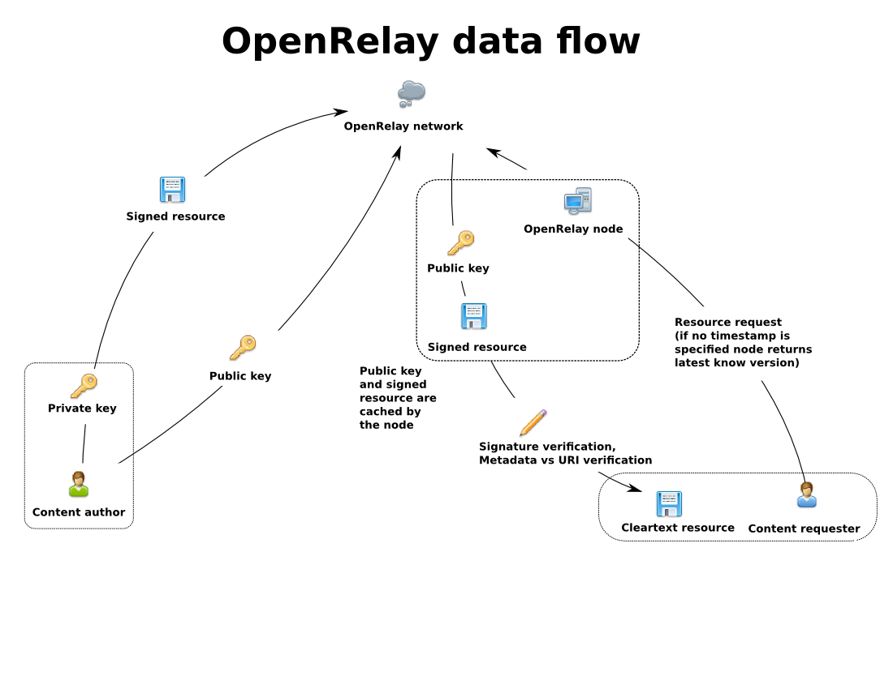
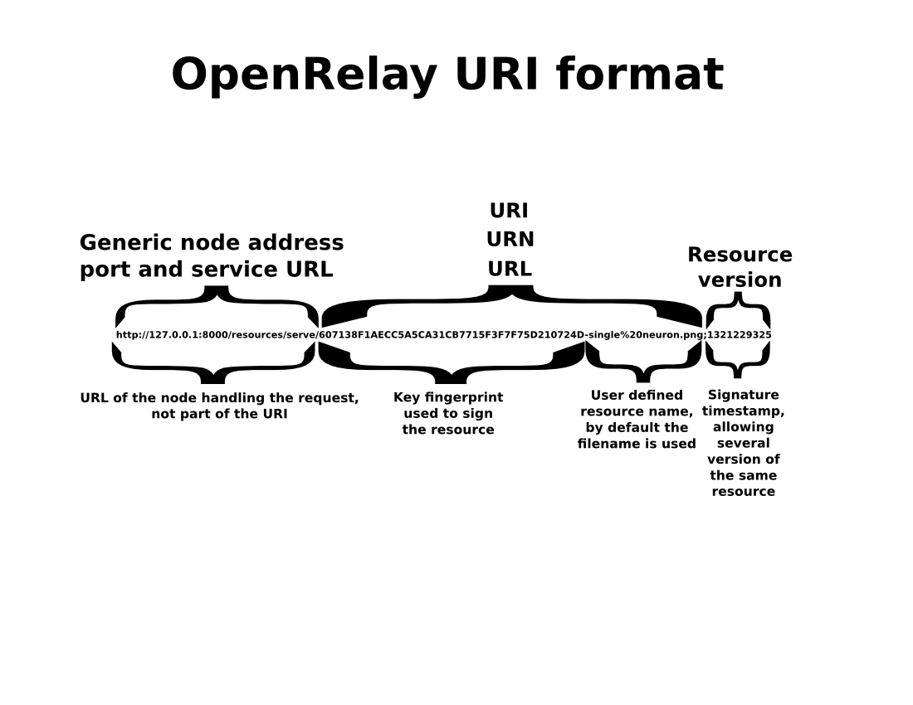
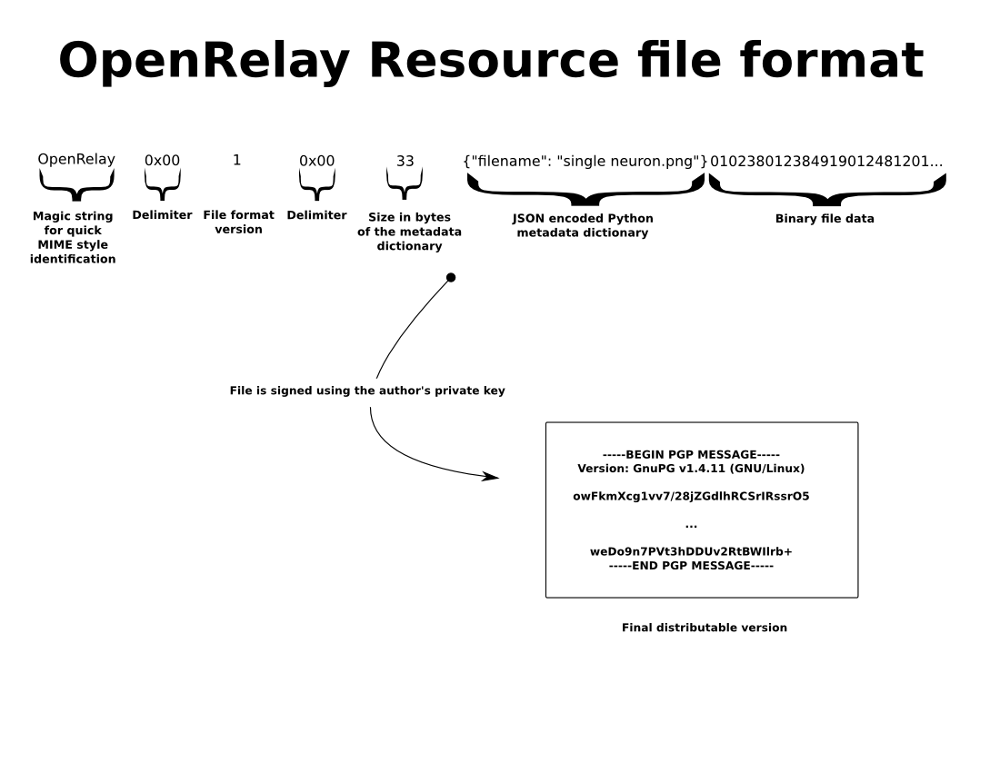
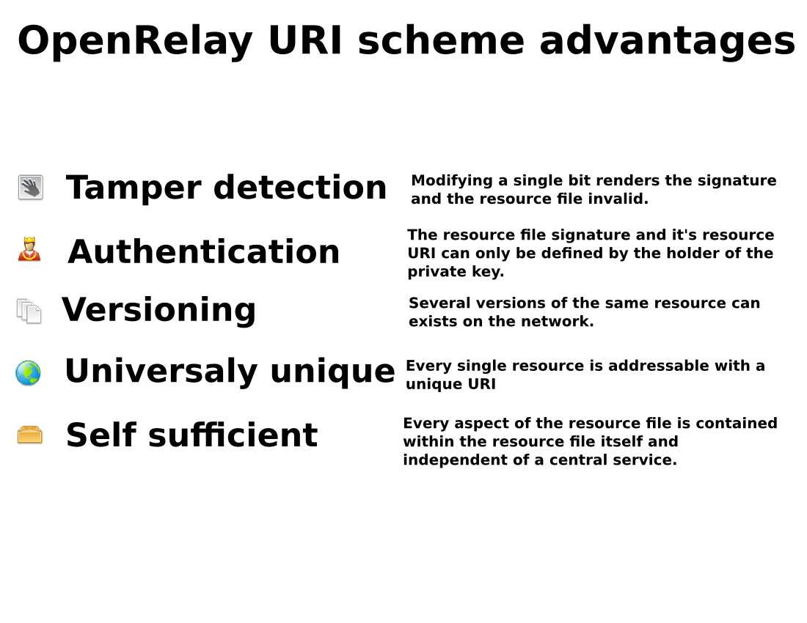

.. _internals:

.. _`Public-key cryptography`: https://en.wikipedia.org/wiki/Public_key

=========
Internals
=========

Basic overview
==============

|architecture|

**OpenRelay** makes extensive use of `Public-key cryptography`_ to sign content uploaded to the network to ensure that such content, by the nature of being distributed and replicated hasn't been tampered.
Traditional peer to peer file sharing networks provide increased content survivability and availability by creating and distributing copies, this works very good when users accessing content expect such content to never change, this mode of operation resembles that of a static repository.
This mode of operation create a problem for content publishers where previously uploaded content will have a very different identification code than a more recently uploaded content with the publisher being unable announce to users of the network that a newer version of the same content is available.
In effect the two versions are completely different instances of content replicated in the peer to peer network without any relation to each other.  This is the reason existing peer to peer file sharing networks are not suitable for more dynamic uses such as web hosting.
**OpenRelay** solves this problem, creating authenticated universally addressable versioned resources.  When a user publishes content a unique identifier containing the user's personal key id and a name is created.
This new content converted into an **OpenRelay** resource is also cryptographically time stamped, and this time stampbecomes the resource version number.
If the user wishes to update the resource file, he just publishes new content with the same key and the same name, but this new resource will have a more recent timestamp, hence both resource have the same identifier but can be addressed individually if necesary.
If another user wishes to access the resource file published by the first user, only the resource identifier needs to be specified with the network fetching the most recent version.
Both versions of the resource exists on the network but as the older version is less and less requested, it will eventually disapear from the network as the individual nodes erase the less requested content from their respective caches.

URI specification
=================

|uri_specs|

An **OpenRelay** resource identifier is crafted using the publisher's key fingerprint and appending a name to it, by default the original filename is used but the publisher can choose any string of characters.
The resource identifier doesn't include any actual server location, because the same resource can be requested from any node in the network.

Resource file format
====================

|file_format|

This is the actual content of the resource file, the filename is the only required metadata field and is used by recipients of the resource file for validation by appending it to the key fingerprint used during signing.

Advantages
==========

|advantages|

Resource reference
==================

Literals
--------
.. automodule:: openrelay_resources.literals
    :members: BINARY_DELIMITER

Exceptions
----------
.. module:: openrelay_resources.exceptions
.. autoexception:: ORInvalidResourceFile

Classes
-------
.. module:: openrelay_resources.models
.. autoclass:: ResourceBase
.. autoclass:: Resource

